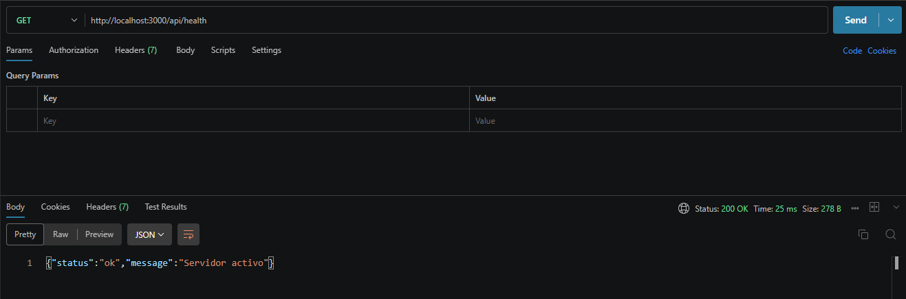
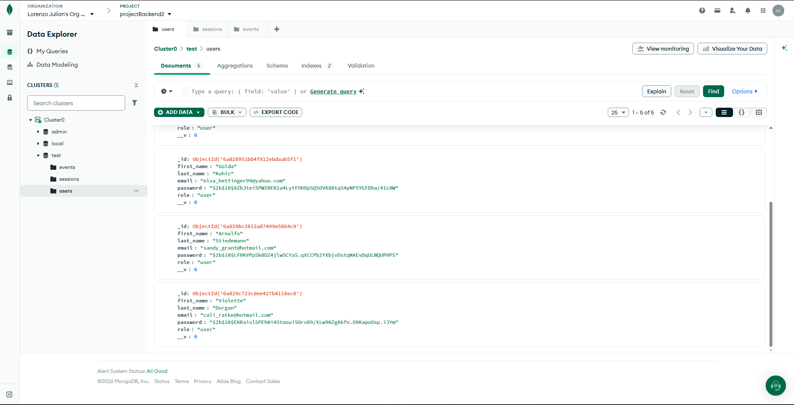

# Backend2
REPOSITORIO PARA LA PRE-ENTREGA 3
Repositorio de entregas para la materia Programacion Backend II: Diseño y Arquitectura Backend por Lorenzo Suarez Almeyra, temática de eventos y sesiones 

## Base de datos

- Estare utilizando MongoDB

## Tecnologías
- Node.js
- Express
- Nodemon
- dotenv
- mongoose

## Instalación
```bash
npm install
```

## Iniciacion
```bash
npm run dev
```

## Rutas disponibles

### Health check

- `GET /api/health`

### Eventos

- `GET /api/events`
- `GET /api/events/:id`
- `POST /api/events/createEvent`

### Sesiones

- `GET /api/sessions`
- `GET /api/sessions/:eventId`
- `POST /api/sessions/createSession`
- `POST /api/sessions/register`

## Flujo de datos
Request → Router → Controller → Service → Repository → DAO → Model

## Estructura de carpetas

```text
backend2/
├── src/
│   ├── app.js
│   ├── server.js
│   ├── config/
│   │   └── config.js
│   ├── controllers/
│   │   ├── event.controller.js
│   │   └── session.controller.js
│   ├── dao/
│   │   ├── event.dao.js
│   │   ├── session.dao.js
│   │   └── user.dao.js
│   ├── middlewares/
│   │   └── error.middleware.js
│   ├── models/
│   │   ├── eventModel.js
│   │   ├── sessionModel.js
│   │   └── userModel.js
│   ├── repositories/
│   │   ├── event.repository.js
│   │   ├── session.repository.js
│   │   └── user.repository.js
│   ├── routes/
│   │   ├── event.router.js
│   │   └── session.router.js
│   ├── services/
│   │   ├── event.service.js
│   │   └── session.service.js
│   └── utils/
│       └── hash.js
├── .env.example
├── .gitignore
├── package.json
├── package-lock.json
└── README.md
```
### Registrar un usuario

En el endpoint POST /api/sessions/register crea un usuario nuevo. El servidor debe estar iniciado y se debe enviar una peticion a:

```text
http://localhost:8080/api/sessions/register
```

El body debe ser un objeto JSON. Los campos `first_name`, `last_name`, `email` y `password` son obligatorios. El campo `role` no puede ser manipulado en el body

```json
{
    "first_name": "Bertram",
    "last_name": "García",
    "email": "bertram.garcia@example.com",
    "password": "12345678"
}
```

Durante el registro:

- Se eliminan los espacios al principio y al final del nombre, apellido y email.
- El email se convierte a minúsculas.
- Se valida que el email tenga un formato válido.
- La contraseña se guarda hasheada y no se devuelve en la respuesta.
- Se comprueba que el email no esté registrado previamente.

Respuesta exitosa (`201 Created`):

```json
{
    "status": "success",
    "payload": {
        "id": "ID_GENERADO_POR_MONGODB",
        "first_name": "Bertram",
        "last_name": "García",
        "email": "bertram.garcia@example.com",
        "role": "user"
    }
}
```

Si faltan campos obligatorios, el email no es válido o ya existe, la API devuelve una respuesta con `status: "error"` y un mensaje descriptivo.

## Capturas de entregas
### Entrega 1
- 
### Entrega 2
- 
- 